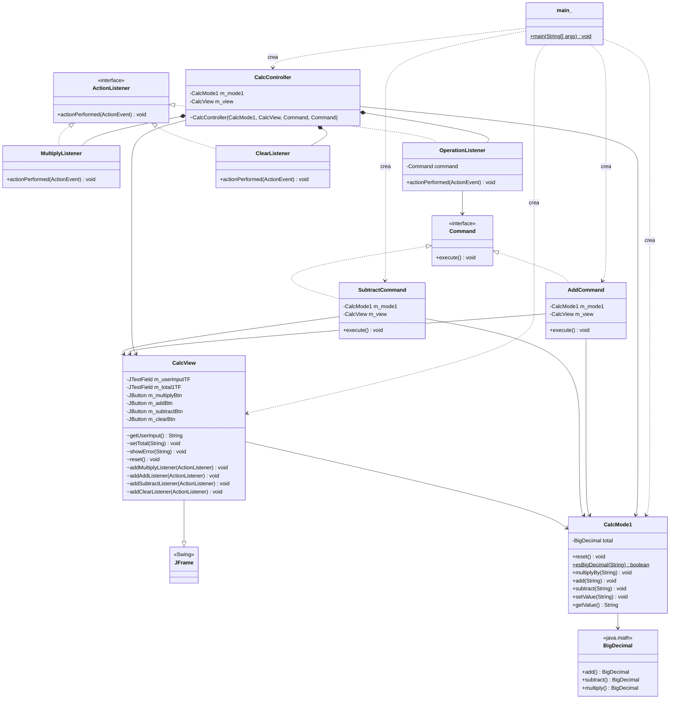

```mermaid
classDiagram
    direction TB

    %% ===== CLIENTE =====
    class main_ {
        +main(String[] args)$ void
    }

    %% ===== CONTROLADOR =====
    class CalcController {
        -CalcMode1 m_mode1
        -CalcView m_view
        ~CalcController(CalcMode1, CalcView, Command, Command)
    }

    class MultiplyListener {
        +actionPerformed(ActionEvent) void
    }
    class OperationListener {
        -Command command
        +actionPerformed(ActionEvent) void
    }
    class ClearListener {
        +actionPerformed(ActionEvent) void
    }

    class ActionListener {
        <<interface>>
        +actionPerformed(ActionEvent) void
    }

    %% ===== COMMAND =====
    class Command {
        <<interface>>
        +execute() void
    }
    class AddCommand {
        -CalcMode1 m_mode1
        -CalcView m_view
        +execute() void
    }
    class SubtractCommand {
        -CalcMode1 m_mode1
        -CalcView m_view
        +execute() void
    }

    %% ===== VISTA =====
    class JFrame {
        <<Swing>>
    }
    class CalcView {
        -JTextField m_userInputTF
        -JTextField m_total1TF
        -JButton m_multiplyBtn
        -JButton m_addBtn
        -JButton m_subtractBtn
        -JButton m_clearBtn
        ~getUserInput() String
        ~setTotal(String) void
        ~showError(String) void
        ~reset() void
        ~addMultiplyListener(ActionListener) void
        ~addAddListener(ActionListener) void
        ~addSubtractListener(ActionListener) void
        ~addClearListener(ActionListener) void
    }

    %% ===== MODELO =====
    class CalcMode1 {
        -BigDecimal total
        +reset() void
        +esBigDecimal(String)$ boolean
        +multiplyBy(String) void
        +add(String) void
        +subtract(String) void
        +setValue(String) void
        +getValue() String
    }
    class BigDecimal {
        <<java.math>>
        +add() BigDecimal
        +subtract() BigDecimal
        +multiply() BigDecimal
    }

    %% ----- Cliente crea todo -----
    main_ ..> CalcController : crea
    main_ ..> AddCommand : crea
    main_ ..> SubtractCommand : crea
    main_ ..> CalcView : crea
    main_ ..> CalcMode1 : crea

    %% ----- Controlador -----
    CalcController *-- MultiplyListener
    CalcController *-- OperationListener
    CalcController *-- ClearListener
    ActionListener <|.. MultiplyListener
    ActionListener <|.. OperationListener
    ActionListener <|.. ClearListener
    OperationListener --> Command

    %% ----- Command -----
    Command <|.. AddCommand
    Command <|.. SubtractCommand

    %% ----- Dependencias hacia Vista y Modelo -----
    CalcController --> CalcView
    CalcController --> CalcMode1
    AddCommand --> CalcView
    AddCommand --> CalcMode1
    SubtractCommand --> CalcView
    SubtractCommand --> CalcMode1
    CalcView --|> JFrame
    CalcView --> CalcMode1
    CalcMode1 --> BigDecimal
```